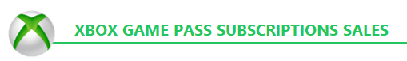
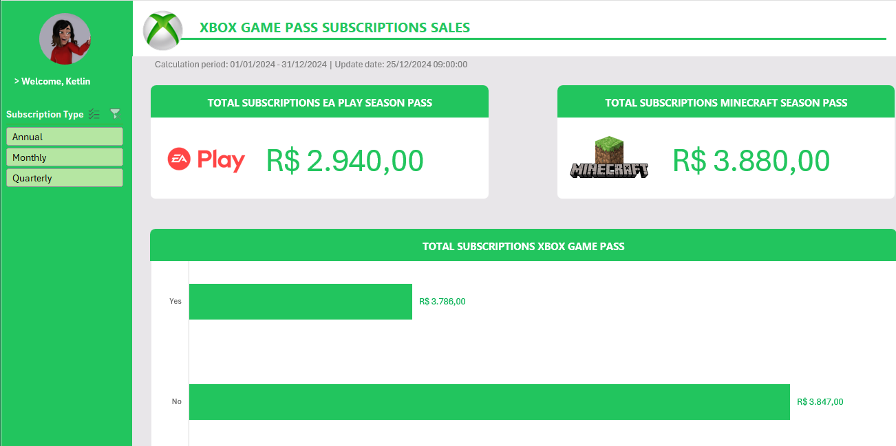

# Dashboard de Vendas - Plataforma Xbox

Este projeto apresenta um **dashboard interativo de vendas** desenvolvido no Excel, utilizando uma amostra da base de dados de vendas da plataforma Xbox.

## 🔍 Visão Geral

O dashboard permite a análise de desempenho de vendas com segmentações por tipo de renovação de assinatura:

- **Anual**
- **Mensal**
- **Trimestral**

## 🛠 Funcionalidades

- Visualização de vendas **anuais**, **mensais** e **trimestrais**
- Análise de usuários que utilizam **EA Play Pass** e **Minecraft Pass**
- Gráficos dinâmicos e interativos
- Interface amigável e intuitiva

## 📚 Base de Conhecimento

Este projeto foi desenvolvido com base na aula de Excel da plataforma **[DIO - Digital Innovation One](https://www.dio.me/)**, aplicando os conceitos aprendidos em um cenário prático de análise de dados, através do curso **Santander - Excel com Inteligência Artificial**.

## 📁 Arquivos

- `Sales_Xbox.xlsx`: Planilha com o dashboard interativo
- `README.md`: Este arquivo de documentação

## Visão Geral da Ferramenta

## Licença

Este projeto está licenciado sob a [MIT License](LICENSE).

## Autor

Desenvolvido por Ketlin Danieli de Lima.
